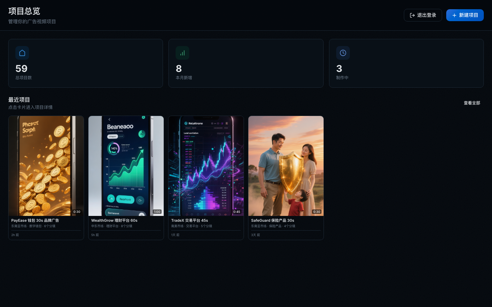
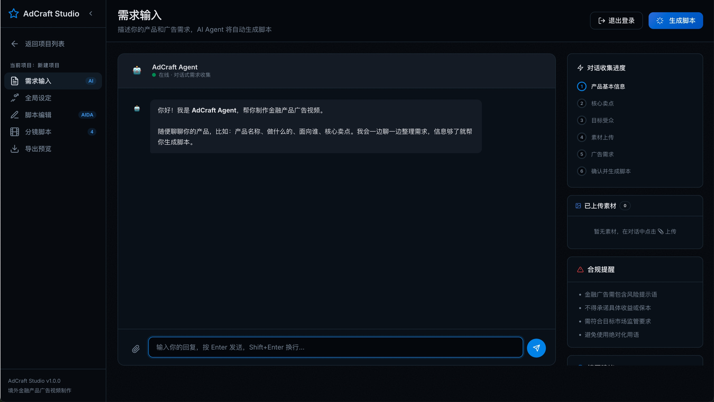
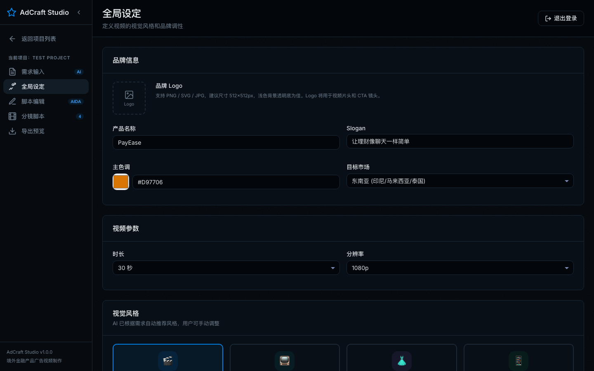
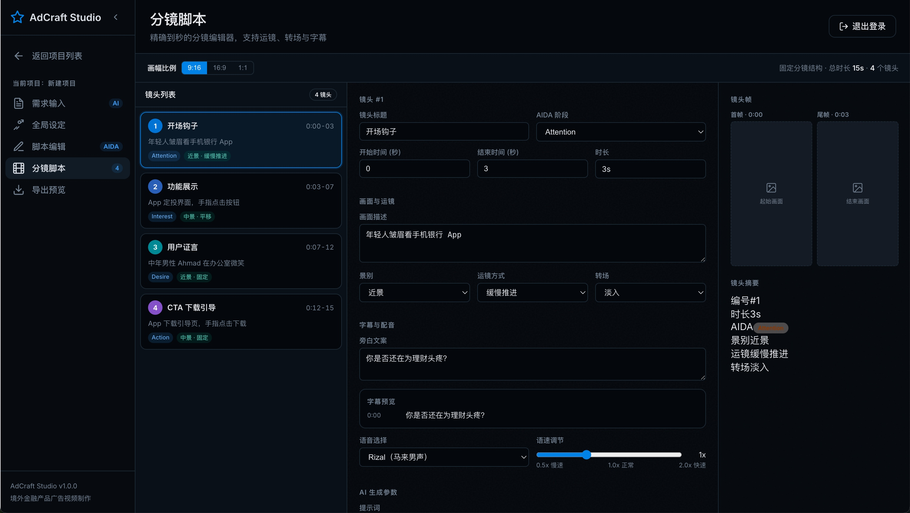
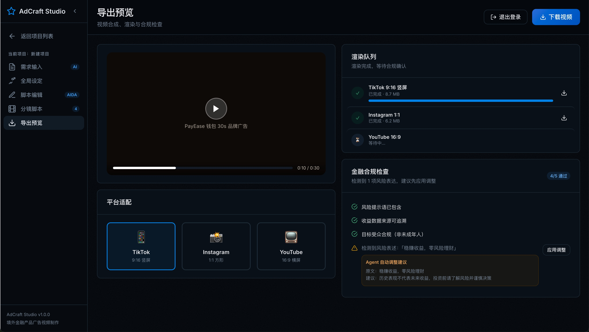

# AdCraft Studio 产品白皮书

## 一、产品简介

AdCraft Studio 是一款面向海外金融产品营销团队的 AI 广告视频创作平台，帮助企业将广告视频生产流程从“依赖人工经验的离散协作”升级为“可复制、可控、可规模化的智能生产流程”。

针对数字钱包、理财平台、交易平台、保险产品等金融营销场景，AdCraft Studio 提供从需求收集、脚本生成、分镜编排到导出合规检查的一体化工作台，帮助团队同时提升内容生产效率、表达一致性与审核通过率。

此文档的核心目标，是说明：为什么 AdCraft Studio 适合金融行业客户，以及它将如何直接创造业务价值。

---

## 二、客户当前面临的问题

在金融广告视频生产场景中，客户通常面临以下共性挑战：

### 1. 创意启动慢

一个视频项目往往需要经历多轮沟通，需求信息分散在聊天记录、表格、文档和口头讨论中，导致项目启动慢、反复确认多。

### 2. 多角色协作效率低

业务、策划、文案、设计、视频与审核团队往往使用不同工具协作，信息同步成本高，修改链条长。

### 3. 多市场适配难

面向不同国家和地区时，卖点表达、语言选择、风格偏好和平台节奏都需要重新适配，复用效率低。

### 4. 合规返工成本高

金融广告最常见的问题不是“做不出来”，而是“做出来后不能投”。涉及收益承诺、风险提示、受众表达等问题时，返工常常发生在最后阶段。

### 5. 项目资产无法沉淀

做过的脚本、分镜、视觉方案和案例难以形成可复用资产，团队每次都像从零开始。

---

## 三、AdCraft Studio 的解决方案

AdCraft Studio 通过一个统一工作台，把创意生产流程标准化为五个主要阶段：

1. 需求输入
2. 全局设定
3. 脚本编辑
4. 分镜脚本
5. 导出预览

同时产品提供项目总览与项目列表页，帮助团队统一管理多个视频项目，并通过筛选能力快速进入目标项目。

### 3.1 需求输入：把模糊需求变成结构化信息

系统通过对话方式引导用户先收集必填信息：

- 产品名称
- 产品类型
- 目标市场

在此基础上，再对可选信息进行补充与确认：

- 核心卖点
- 目标受众
- 视频语言

这种方式能够显著减少无效沟通，让后续脚本和分镜生产建立在统一、明确的信息基础上。

### 3.2 全局设定：统一创意方向

在全局设定阶段，系统自动推荐视觉风格与配乐风格，当前支持四类视觉表达：

- 电影质感
- 剧情写实
- 商务场景
- 产品展示

这让团队在保持品牌统一性的同时，也可以针对不同目标进行手动调整。

### 3.3 脚本编辑：结构化生成广告表达

脚本编辑页采用 AIDA 结构，让视频创意围绕注意力、兴趣、欲望和行动四个核心环节组织，帮助业务团队更稳定地输出可投放文案。

### 3.4 固定分镜结构：提升交付稳定性

AdCraft Studio 采用固定分镜结构，而不是让每个项目自由发散。这样可以：

- 缩短创意制作时间
- 提升不同项目之间的复用效率
- 降低团队交接和审核难度

### 3.5 导出前合规检查：把风险前移

在导出预览阶段，系统通过状态化合规检查机制，帮助客户在下载前处理风险表达。

能力包括：

- 待检查 / 待结果 / 已完成状态展示
- 风险表述识别
- Agent 自动调整建议
- 用户确认后放行下载

这意味着问题会在交付前暴露并解决，而不是在投放环节被动返工。

---

## 四、客户将获得的核心价值

### 4.1 更快的内容生产速度

通过结构化需求输入、统一脚本框架和固定分镜流程，AdCraft Studio 能帮助团队缩短从需求到可交付内容的周期。

### 4.2 更低的协同成本

所有角色围绕统一项目工作台协同，减少信息分散和重复沟通，提高团队执行效率。

### 4.3 更强的合规控制能力

通过导出前的风险识别和调整机制，降低因收益表达、受众表述或风险提示缺失造成的返工和审核风险。

### 4.4 更高的项目复用效率

通过项目总览、项目列表、脚本结构与分镜结构沉淀，使成功案例更容易被复制到新市场和新业务线。

---

## 五、典型客户场景

### 场景一：数字钱包产品拉新

客户需要面向东南亚市场持续输出获客视频。AdCraft Studio 可以帮助团队快速完成需求整理、脚本表达、界面展示分镜与多平台导出。

### 场景二：理财平台品牌教育

客户需要生产更具可信度和教育属性的视频内容。AdCraft Studio 通过 AIDA 脚本与合规控制能力，帮助内容既清晰又更适合金融传播。

### 场景三：代理商多客户并行交付

对于同时服务多个金融客户的代理团队，AdCraft Studio 提供项目列表筛选、固定结构生产和统一合规出口，显著提升交付效率。

### 场景四：保险产品合规传播

面向高敏感表达场景，系统可将风险检查前移到导出阶段，帮助团队在上线前处理问题文案。

---

## 六、为什么客户会选择 AdCraft Studio

客户选择 AdCraft Studio，不只是因为它能“生成内容”，而是因为它同时解决了以下四件事：

1. 让需求更清楚
2. 让生产更高效
3. 让输出更统一
4. 让风险更可控

在金融营销场景里，这四件事往往比单纯的“内容生成速度”更重要。

---

## 七、合作价值

对于客户而言，AdCraft Studio 可以带来的合作价值包括：

- 帮助业务团队提升视频创意产能
- 帮助营销团队降低项目协同成本
- 帮助审核团队前移风险发现节点
- 帮助管理层沉淀可复用的内容生产资产

对于合作伙伴而言，它也意味着一个更容易标准化交付、更容易规模化复制的金融内容生产系统。

---

## 八、结论

AdCraft Studio 不是一个单点创意工具，而是一套面向金融行业的广告视频生产解决方案。

它帮助客户把广告视频创作从“人驱动的离散协作”升级为“系统驱动的标准化生产”，在提升效率的同时，兼顾表达质量、团队协同和合规控制。

如果客户当前正在面临多市场视频生产、金融内容审核压力、创意协作效率低或案例资产难复用的问题，AdCraft Studio 将是一个直接且可落地的解决方案。
