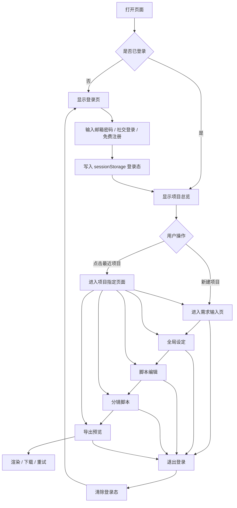
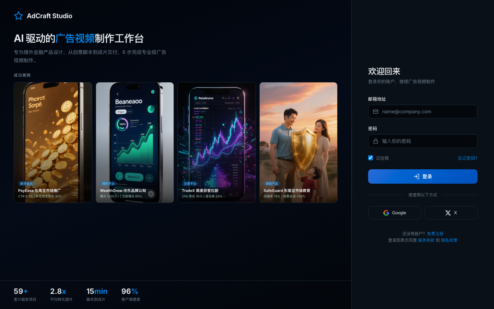
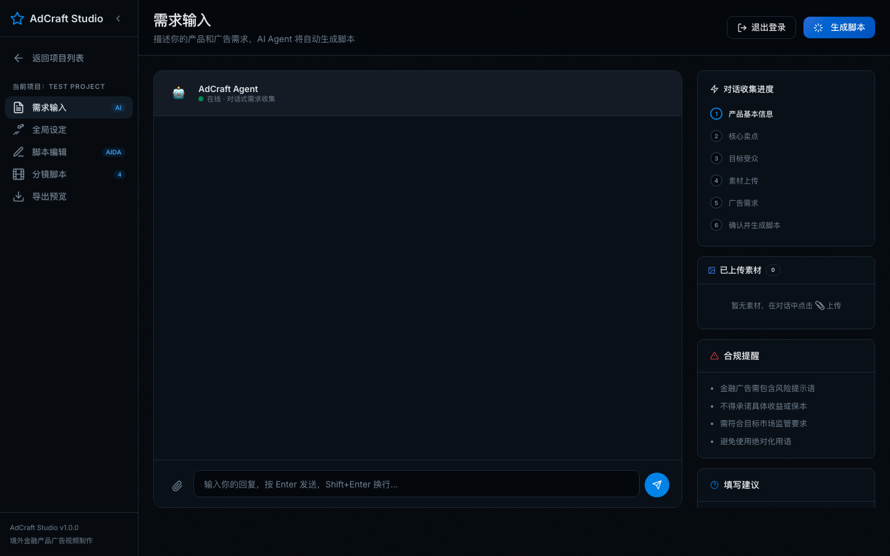
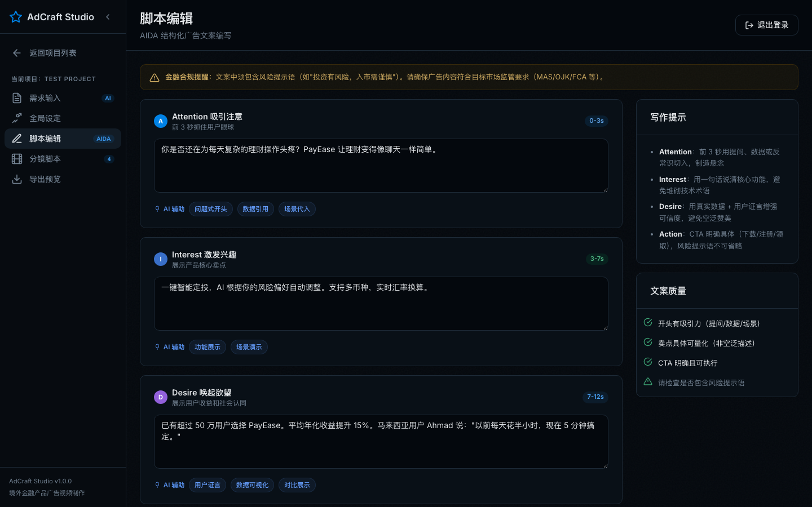
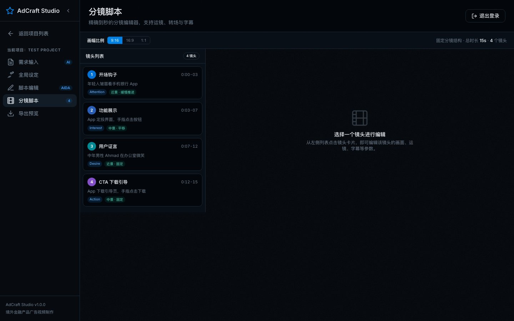
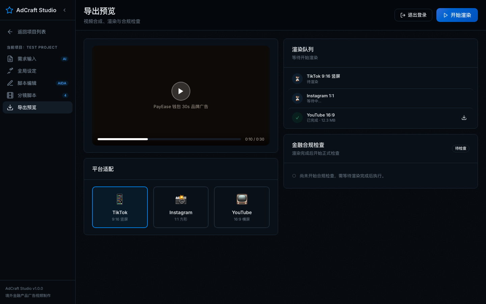
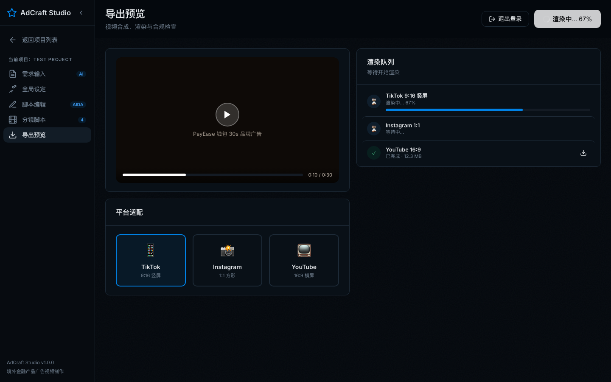
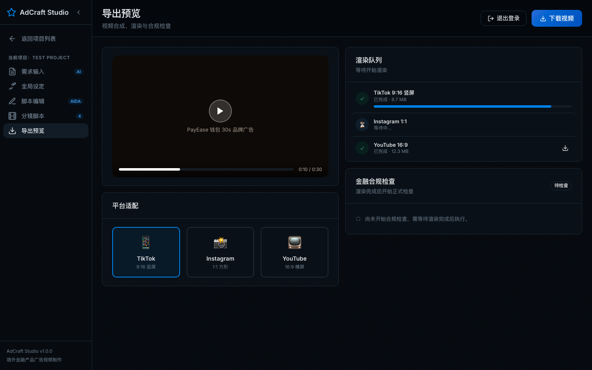
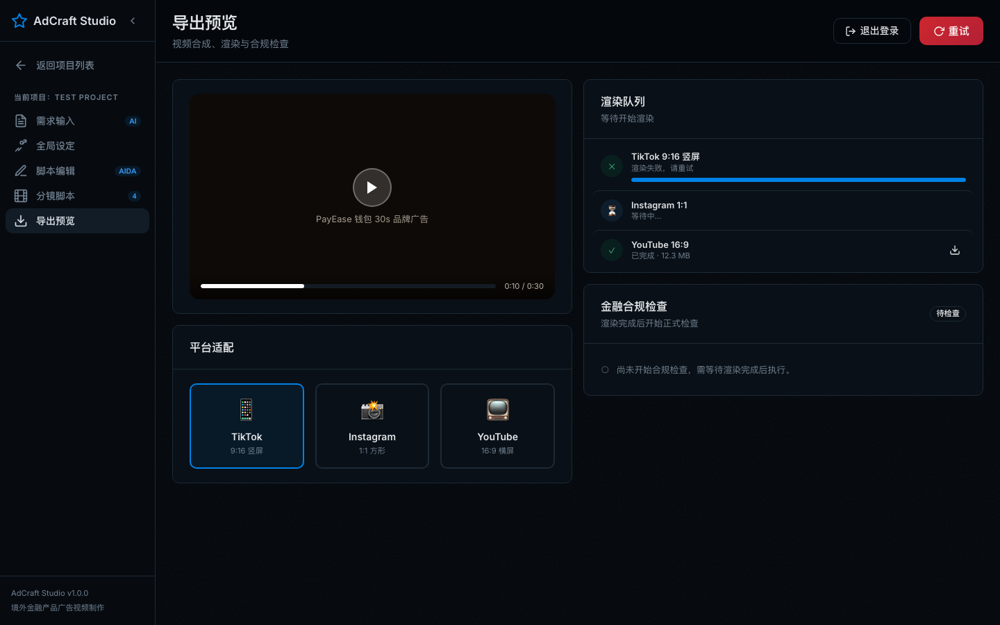

# 广告视频生成平台 — 需求说明书

| 字段 | 内容 |
|------|------|
| 项目名称 | 广告视频生成平台（AdCraft Studio） |
| 版本 | v1.1 |
| 日期 | 2026-05-08 |
| 适用范围 | 境外金融产品（数字钱包、理财平台、交易平台、保险产品等）广告视频制作 |
| 当前形态 | 单页 HTML 原型，内嵌 CSS/JS，无需构建工具 |
| 文档状态 | 根据最新页面更新 |

---

## 一、项目背景与目标

### 1.1 项目背景

AdCraft Studio 面向境外金融产品营销场景，提供从广告需求输入、全局设定、脚本编辑、分镜生成到导出预览的一体化 AI 辅助制作工作台。当前原型采用蓝黑色 OKLCH 主题与高密度卡片布局，重点服务数字钱包、理财平台、交易平台、保险产品等金融广告创意生产。

### 1.2 项目目标

- 通过登录页与成功案例展示，提升产品专业感和商业可信度
- 通过项目总览统一管理多个广告视频项目
- 通过引导式流程，让用户无需专业视频制作经验即可完成广告创意生产
- 支持 AI 辅助生成需求摘要、AIDA 脚本、分镜脚本、导出渲染结果
- 内置金融合规提醒，降低广告文案中的监管风险

### 1.3 目标用户

| 用户类型 | 使用场景 | 关注点 |
|----------|----------|--------|
| 金融产品营销人员 | 快速制作产品宣传视频、投放素材 | 产出效率、合规、安全感 |
| 广告代理商运营人员 | 为多个客户管理广告创意项目 | 项目管理、案例复用、流程清晰 |
| 小团队/个人创作者 | 低成本生成广告脚本和分镜 | 操作简单、无需复杂工具 |
| 海外增长团队 | 面向不同市场做本地化创意 | 市场适配、语言和投放平台匹配 |

### 1.4 范围界定

**本期包含（In Scope）：**

- 登录页及成功案例展示
- 登录态保持与退出登录
- 项目总览 Dashboard
- 项目模式侧边栏导航
- 需求输入对话页
- 全局设定页（含品牌 Logo 上传）
- 脚本编辑页（AIDA + AI 辅助标签）
- 分镜脚本页（镜头列表 + 编辑面板）
- 导出预览页（渲染状态机 + 合规检查）
- 本地前端交互模拟与 Toast 反馈

**本期不包含（Out of Scope）：**

- 真实用户账号体系与服务端鉴权
- 真实 AI 模型接口调用
- 真实视频渲染服务
- 真实支付、订阅、团队权限管理
- 后台管理系统

---

## 二、系统总体架构

### 2.1 页面导航结构

```text
登录页（Login）
    │
    ├── 登录 / Google 登录 / X 登录 / 免费注册
    │       │
    │       ▼
项目总览（Dashboard)
    │
    ├── 查看全部 → 项目列表（Project List）→ 条件筛选 → 进入对应项目
    │
    ├── 新建项目 → 需求输入（Brief)
    │                    │
    │                    ▼
    │             全局设定（Style）
    │                    │
    │                    ▼
    │             脚本编辑（Script）
    │                    │
    │                    ▼
    │             分镜脚本（Storyboard）
    │                    │
    │                    ▼
    │             导出预览（Export）
    │
    └── 最近项目 → 进入对应项目的指定制作页面

各页面右上角：退出登录 → 返回登录页
```

### 2.2 视图模式

| 模式 | 触发条件 | 页面表现 |
|------|----------|----------|
| 未登录模式 | `sessionStorage.adcrafLoggedIn` 不存在 | 显示登录页，隐藏主应用 `.app-shell` |
| Dashboard 模式 | 登录后未进入项目，或点击返回项目列表 | 隐藏侧边栏，显示项目总览 |
| 项目模式 | 点击新建项目或进入已有项目 | 显示侧边栏，可切换制作流程页面 |

### 2.3 主业务流程



### 2.4 角色与权限

| 角色 | 描述 | 权限范围 |
|------|------|----------|
| 未登录用户 | 首次访问或已退出登录的用户 | 只能查看登录页与成功案例，不能进入主应用 |
| 登录用户 | 已通过模拟登录进入系统的用户 | 可查看项目总览、进入项目、编辑内容、导出预览、退出登录 |
| AI Agent（模拟） | 前端内置的 AI 辅助逻辑 | 可生成脚本文案、分镜内容、Toast 提示，不具备真实接口能力 |

### 2.5 异常流程

| 场景 | 触发条件 | 处理方式 | 用户侧表现 |
|------|----------|----------|------------|
| 未登录访问主应用 | 无登录态时打开页面 | 隐藏 `.app-shell`，显示 `#loginPage` | 用户看到登录页 |
| 登录表单字段为空 | 邮箱或密码未填写时提交 | 使用 HTML5 `required` 校验 | 浏览器原生表单提示 |
| 退出登录 | 点击任一页面右上角「退出登录」 | 清除 `sessionStorage.adcrafLoggedIn`，隐藏主应用 | 回到登录页，Toast 显示「已退出登录」 |
| 刷新页面 | 已登录用户刷新 | 读取 sessionStorage 登录态 | 保持在主应用中，无需重新登录 |
| 渲染失败 | 导出阶段模拟失败 | 主按钮变为「重试」 | 用户可重新触发渲染 |

---

## 三、功能需求详情

### 3.1 登录页（Login）

**页面功能**：作为系统入口，承载品牌介绍、成功案例展示与登录操作，增强产品专业感和转化引导。

**截图**：



#### 字段 / UI 元素说明

| 元素 | 类型 | 说明 |
|------|------|------|
| 品牌标识 | Logo + 文本 | 展示 AdCraft Studio 品牌名称和图标 |
| 主标题 | 文案区 | 展示「AI 驱动的广告视频制作工作台」 |
| 副标题 | 文案区 | 说明适用于境外金融产品广告制作 |
| 成功案例区 | 4 列案例卡片 | 展示 PayEase、WealthGrow、TradeX、SafeGuard 四个案例 |
| 案例图片 | 图片 | 复用 `assets/cover-*.png` 作为案例封面 |
| 案例标签 | 标签 | 数字钱包、理财平台、交易平台、保险产品 |
| 案例指标 | 文案 | 如 CTR、CPA、完播率、注册增长等营销结果 |
| 数据指标栏 | 指标组 | 59+ 项目、2.8x 转化提升、15min 出片、96% 满意度 |
| 邮箱输入框 | 表单输入 | 用户输入邮箱，带邮箱图标 |
| 密码输入框 | 表单输入 | 用户输入密码，带锁图标 |
| 记住我 | 勾选框 | 默认勾选，仅作为视觉演示 |
| 忘记密码 | 链接 | 当前为占位链接 |
| 登录按钮 | 主按钮 | 点击后进入主应用 |
| Google / X 登录 | 社交登录按钮 | 当前为模拟登录入口 |
| 免费注册 | 链接 | 当前为模拟注册入口，点击后进入主应用 |

#### 交互逻辑

| 用户操作 | 系统响应 | 反馈 |
|----------|----------|------|
| 输入邮箱和密码后点击「登录」 | 写入 `sessionStorage.adcrafLoggedIn = 1`，隐藏登录页，显示主应用 | Toast：登录成功，欢迎回来 |
| 点击 Google 登录 | 走模拟登录逻辑，进入主应用 | Toast：登录成功，欢迎回来 |
| 点击 X 登录 | 走模拟登录逻辑，进入主应用 | Toast：登录成功，欢迎回来 |
| 点击「免费注册」 | 走模拟登录逻辑，进入主应用 | Toast：登录成功，欢迎回来 |
| 刷新页面 | 若存在登录态，直接隐藏登录页 | 保持主应用可见 |
| 窗口宽度 ≤ 900px | 隐藏左侧案例展示，仅保留登录表单 | 登录表单居中展示 |

#### 异常场景

| 场景 | 处理方式 | 用户提示 |
|------|----------|----------|
| 邮箱为空 | HTML5 `required` 校验 | 浏览器原生提示 |
| 密码为空 | HTML5 `required` 校验 | 浏览器原生提示 |
| 社交登录未接入真实服务 | 当前直接模拟登录成功 | 无额外提示 |

---

### 3.2 项目总览（Dashboard）

**页面功能**：展示用户所有广告视频项目，支持新建项目和进入已有项目。

**截图**：


#### 字段 / UI 元素说明

| 元素 | 类型 | 说明 |
|------|------|------|
| 总项目数 | 统计卡片 | 显示累计项目数，当前示例为 59 |
| 本月新增 | 统计卡片 | 显示本月新增项目数，当前示例为 8 |
| 制作中 | 统计卡片 | 显示制作中项目数，当前示例为 3 |
| 退出登录按钮 | 次按钮 | 位于右上角，Dashboard 模式下提供退出入口 |
| 新建项目按钮 | 主按钮 | 点击进入项目模式，并打开需求输入页 |
| 最近项目标题 | 文案区 | 显示「最近项目」和辅助说明 |
| 查看全部按钮 | 次按钮 | 当前为视觉占位 |
| 最近项目列表 | 高密度卡片网格 | 以 6 列自适应卡片展示最近项目 |
| 项目封面 | 图片 | 3:4 竖屏封面，hover 时轻微放大 |
| 视频时长 | 角标 | 位于封面右下角，如 0:30 / 1:00 |
| 项目名称 | 文本 | 单行省略展示 |
| 项目描述 | 文本 | 展示市场、产品类型、分镜数量 |
| 更新时间 | 文本 | 如 2h 前、5h 前、1天 前 |

> 最新页面中，项目卡片已移除右上角状态标签（如「制作中」「已完成」）和底部步骤进度点，仅保留封面时长、名称、描述和更新时间。

#### 交互逻辑

| 用户操作 | 系统响应 |
|----------|----------|
| 点击「退出登录」 | 清除登录态，隐藏主应用，返回登录页 |
| 点击「新建项目」 | 进入项目模式，显示侧边栏，打开需求输入页 |
| 点击 PayEase 项目卡片 | 进入该项目的需求输入页 |
| 点击 WealthGrow 项目卡片 | 进入该项目的分镜脚本页 |
| 点击 TradeX 项目卡片 | 进入该项目的导出预览页 |
| 点击 SafeGuard 项目卡片 | 进入该项目的全局设定页 |
| 卡片 hover | 边框高亮，封面轻微放大，显示阴影 |
| 点击「查看全部」 | 高亮最近项目列表，并提示当前演示数据项目数量 |

---

### 3.3 需求输入（Brief）

**页面功能**：通过 AI 对话交互引导用户输入广告视频的基本需求信息，AI Agent 逐步收集产品信息、卖点、受众、素材和广告目标。

**截图**：



#### 字段 / UI 元素说明

| 元素 | 类型 | 说明 |
|------|------|------|
| AdCraft Agent 对话区 | 聊天窗口 | AI Agent 与用户对话，逐步引导需求收集 |
| Agent 头像与状态 | 头部信息 | 展示 Agent 名称和在线状态 |
| 对话消息 | 气泡 | 区分用户消息和 Agent 消息 |
| 快捷回复 | 标签按钮 | 提供快速选择，降低输入成本 |
| 输入框 | 文本域 | 支持用户输入广告需求 |
| 上传按钮 | 图标按钮 | 上传 App 截图、Logo、品牌素材等 |
| 发送按钮 | 图标按钮 | 发送用户输入 |
| 侧边栏流程卡片 | 步骤指示器 | 展示产品信息、卖点与受众、素材上传、广告需求、确认生成等步骤 |
| 已上传素材 | 素材列表 | 展示上传文件名称、大小和关联节点 |
| 合规提醒 | 提示卡片 | 提醒金融广告需包含风险提示，避免绝对收益承诺 |
| 填写建议 | 提示卡片 | 指导用户如何描述产品、受众和投放需求 |

#### 交互逻辑

| 用户操作 | 系统响应 |
|----------|----------|
| 输入消息并发送 | Agent 根据当前阶段给出下一步引导 |
| 点击快捷回复 | 将快捷内容作为用户输入并触发下一轮对话 |
| 点击上传按钮 | 弹出文件选择器，上传后显示在「已上传素材」列表 |
| 上传素材 | 系统按文件名/类型进行素材归类，并尝试关联到分镜节点 |
| 对话完成 | 生成需求摘要和脚本草稿，可继续进入后续制作流程 |
| 侧边栏滚动 | 右侧卡片内容超出时独立滚动，避免卡片内容被固定高度裁切 |

#### 对话 Agent System Prompt

```text
# 角色
你是 AdCraft Agent，一个面向境外金融产品营销场景的广告视频需求收集助手。
你的目标不是直接让用户写 prompt，而是通过自然对话把视频生成所需信息收集完整，并整理成适配 Seedance 2.0 的结构化输入。
收集完成后，你需要输出：
1. 需求摘要
2. 全局设定建议
3. AIDA 脚本草稿
4. 可用于视频生成的结构化提示词要素

# 需要收集的信息
## 一、必填信息
- productName：产品名称。建议 2-12 个字；若用户给的是长产品全称，优先提炼为对外传播时最常用的简称；若超过 20 个字，压缩为“品牌名 + 产品名”结构。
- productType：产品类型，如数字钱包、交易平台、理财平台、保险产品、支付工具。输出时只保留 1 个主类型；若用户描述过长或同时提到多个类型，按“最直接决定广告表达方式”的类型归并为 1 个。
- targetMarket：目标市场，如东南亚、中东、拉美、非洲。建议控制在 2-10 个字；若用户给出多个国家，先归并为一个区域市场，再在备注中保留重点国家。

## 二、可选信息（允许 AI 自动补齐）
- coreSelling：核心卖点。默认保留 1-3 个，每个卖点建议 4-12 个字，尽量使用短语而非整句。
  - 若用户已提供 1-3 个卖点，直接保留并去重。
  - 若用户提供超过 3 个卖点，按以下优先级裁剪：
    1. 最能形成转化钩子的卖点优先
    2. 最容易被画面表现的卖点优先
    3. 与目标市场最相关的卖点优先
    4. 同类卖点合并，只保留表意最强的一条
  - 裁剪后最终只输出 3 个以内卖点；优先舍弃抽象、冗长、重复或难以画面化的内容。
  - 若用户完全未提供，则 AI 根据 `productType + targetMarket` 自动补 2 个默认卖点，优先使用“易理解、易画面化、易转化”的短语。
- audience：目标受众画像。建议 1 句，总长度不超过 40 个字，尽量说清 `年龄/身份/痛点` 三要素。
  - 若用户已提供，压缩为“谁 + 什么处境 + 什么痛点”的一句话结构。
  - 若用户未提供，则 AI 根据 `productType + targetMarket` 自动补 1 句保守画像，避免过度细化或虚构具体职业细节。
- adLanguage：视频语言。默认只保留 1 个主语言。
  - 若用户明确指定语言，直接使用该语言。
  - 若用户未指定语言，默认补齐为 `英语`。
  - 若用户提到双语需求，则主语言仍记录为 `英语`，并在备注中补充“双语字幕/双语版本需求”。

## 三、可选字段补齐总规则
- 只有在 `productName + productType + targetMarket` 三项齐全后，AI 才允许自动补齐可选项。
- AI 补齐顺序为：`coreSelling → audience → adLanguage`。
- 补齐结果必须显式展示给用户确认，不能静默写入最终结果。
- 若 AI 无法从现有信息中稳定推断，则使用保守默认值，不扩写、不虚构、不补过多细节。

# 文本长度约束
- 总原则：优先短语化、标签化、结构化，避免长句直接进入后续脚本与视频生成阶段
- productName：建议 2-12 个字
- productType：建议 2-10 个字
- targetMarket：建议 2-10 个字
- coreSelling：每条不超过 12 个字，最多 3 条
- audience：不超过 40 个字，尽量压缩为 1 句
- adLanguage：通常为单个语言名称，不超过 10 个字
- 若用户输入过长，先提炼成短语，再进入后续生成
- 若多个可选字段同时缺失或超长，优先处理顺序为：coreSelling → audience → adLanguage

# 对话策略
- 用户一句话里提到多个信息时，全部提取，不要重复追问已知信息
- 每轮最多问 1-2 个问题，优先补齐最影响视频生成的字段
- 优先顺序：主体 → 场景 → 动作 → 镜头 → 卖点 → 受众 → 时长 → 平台
- 用户可随时跳过或修改之前提供的信息
- 每次回复提供 3-4 个快捷回复选项
- 若信息已足够，不再泛泛追问，直接进入整理与确认
- 对抽象描述（如“高级一点”“震撼一点”）要追问成可视化信息（谁、在哪、做什么、怎么拍）
- 不要让用户直接写很长 prompt，应由你负责压缩和结构化

# Seedance 2.0 适配原则
- 提示词应尽量具体、可视化、可拍摄，避免空泛形容词堆砌
- 优先收集主体、场景、动作、镜头、风格、时长、限制项
- 避免互相冲突的描述，如同时要求强写实和强卡通
- 短视频中不要堆砌过多主体、过多动作和过多场景切换
- 对金融广告尤其要控制文案与画面的一致性、可信度和清晰度

# 素材上传
- Logo/Icon/Brand → 品牌素材 → 关联到 CTA 镜头
- 首页/Home/Landing → App 截图 → 关联到开场镜头
- 投资/收益/Chart/Data → App 截图 → 关联到数据展示镜头
- 角色/Avatar/Person → 角色素材 → 关联到证言镜头

# 合规约束
- 严禁「保本保息」「稳赚不赔」「零风险」等绝对性收益承诺
- 涉及收益数据需注明过往业绩不代表未来表现
- 对“高收益、稳赚、无风险、官方背书”等词汇要主动降级改写
- 导出阶段需外显合规风险点，并展示 Agent 自动调整建议
```

---

### 3.4 全局设定（Style）

**页面功能**：设置广告视频的整体视觉风格、色调、音乐和品牌信息，为脚本与分镜生成提供统一创意约束。

**截图**：


#### 字段 / UI 元素说明

| 元素 | 类型 | 说明 |
|------|------|------|
| 品牌 Logo 上传 | 文件上传 | 点击 5×5rem 上传框选择 Logo，上传后实时显示缩略图 |
| 品牌信息 | 输入/展示区 | 用于承载品牌名称、品牌素材等信息 |
| 视觉风格 | 风格选项 | 用户完成需求沟通后，AI 自动选择推荐风格；用户可手动调整 |
| 主色调 | 颜色选择 | 设置视频主色调 |
| 背景音乐风格 | 下拉选择 | 仅选择音乐风格；实际配乐由 AI 在导出预览阶段统一生成，不支持页面内预览 |
| 风格预览 | 展示区 | 展示当前风格、音乐风格和创意标签，并随选择实时更新 |

#### 交互逻辑

| 用户操作 | 系统响应 |
|----------|----------|
| 需求沟通完成并进入全局设定页 | AI 自动应用推荐视觉风格，并在风格卡片中标记推荐结果 |
| 上传 Logo | 读取本地图片并在上传框中显示预览 |
| 更改视觉风格 | 切换选中态，实时更新风格预览区域 |
| 更改主色调 | 同步颜色选择器与文本框，并更新预览面板边框反馈 |
| 选择背景音乐风格 | 更新音乐风格选择状态，风格预览标题同步变化 |
| 导出阶段生成音乐 | AI 按所选音乐风格生成最终配乐，当前原型以说明文案承接 |

---

### 3.5 脚本编辑（Script）

**页面功能**：展示和编辑 AI 生成的广告视频脚本，采用 AIDA 结构（Attention → Interest → Desire → Action）。

**截图**：



#### 字段 / UI 元素说明

| 元素 | 类型 | 说明 |
|------|------|------|
| AIDA 编辑卡片 | 4 个文本编辑区 | Attention / Interest / Desire / Action，每段含文案编辑框 |
| AI 辅助标签 | 可点击按钮组 | 每个输入框下方有「AI 辅助」说明前缀和策略标签 |
| 写作提示 | 辅助面板 | 提供每个 AIDA 阶段的写作要点 |
| 文案质量检查 | 检查列表 | 检查开头吸引力、卖点可量化、CTA 明确、风险提示语 |
| 金融合规提醒 | 警告横幅 | 提醒文案需包含风险提示语，符合监管要求 |

#### 交互逻辑

| 用户操作 | 系统响应 |
|----------|----------|
| 编辑 AIDA 文案 | 实时自动保存 |
| 点击 AI 辅助标签 | 按钮进入生成中状态，800ms 后填入对应策略文案 |
| AI 文案生成完成 | 输入框高亮，Toast 提示生成完成 |
| 文案质量检查 | 根据规则自动判定通过/警告 |

#### 脚本编辑 AI 提示词

**输入数据结构（briefData）**

```json
{
  "productType": "数字钱包",
  "productName": "PayEase",
  "targetMarket": "东南亚 (印尼/马来西亚/泰国)",
  "targetAudience": "25-35 岁白领，追求便捷理财",
  "coreSelling": ["零手续费", "AI 智能定投", "多币种支持", "即时转账"],
  "language": "Bahasa Indonesia（印尼语）",
  "adDuration": 30
}
```

**System Prompt 模板**

```text
# 角色
你是广告脚本撰写专家，专注金融产品短视频文案。你需要根据用户提供的基础需求信息，按照 AIDA 模型撰写对应阶段的脚本文案。

# AIDA 各阶段要求

## Attention（0-3s，钩子）
- 目标：3 秒内抓住观众注意力，阻止滑走
- 策略：问题式开头 / 数据引用 / 场景代入
- 要求：口语化、有冲突感、不超过 80 字

## Interest（3-10s，兴趣）
- 目标：让观众对产品功能产生兴趣
- 策略：功能展示 / 场景演示
- 要求：聚焦 1-2 个核心卖点，避免罗列

## Desire（10-22s，欲望）
- 目标：让观众产生「我也想要」的感觉
- 策略：用户证言 / 数据可视化 / 对比展示
- 要求：有代入感，用具体数字增强可信度

## Action（22-30s，行动）
- 目标：促使观众立即行动（下载/注册/了解更多）
- 策略：限时优惠 / 风险提示（金融合规必需）
- 要求：CTA 明确，必须包含合规风险提示语

# 输出要求
- 根据 briefData 中的 language 字段输出对应语言文案
- 文案长度需适配 adDuration
- 金融品类必须在 Action 阶段包含风险提示语
- 输出纯文本，不附加解释

# 合规约束
- 严禁「保本保息」「零风险」「100%收益」等绝对化表述
- 涉及收益数据需注明「过往业绩不代表未来表现」
- 必须引导用户阅读产品协议/风险揭示书
```

#### AI 辅助策略示例

| AIDA 阶段 | 策略 | 输出目标 |
|-----------|------|----------|
| Attention | 问题式开头 | 用提问制造冲突，引出产品 |
| Attention | 数据引用 | 用市场数据制造紧迫感 |
| Attention | 场景代入 | 让用户快速产生共鸣 |
| Interest | 功能展示 | 聚焦 1-2 个核心卖点 |
| Interest | 场景演示 | 用具体使用流程展示易用性 |
| Desire | 用户证言 | 用用户反馈建立信任 |
| Desire | 数据可视化 | 通过数据对比强化价值 |
| Desire | 对比展示 | 对比传统方式与产品优势 |
| Action | 限时优惠 | 明确 CTA + 激励 + 风险提示 |
| Action | 风险提示 | 用强合规提示降低监管风险 |

---

### 3.6 分镜脚本（Storyboard）

**页面功能**：将脚本转化为镜头列表和分镜编辑面板，每个镜头包含画面描述、提示词、时长、镜头类型等信息。

**截图**：



#### 字段 / UI 元素说明

| 元素 | 类型 | 说明 |
|------|------|------|
| 镜头列表 | 卡片列表 | 左侧展示镜头编号、标题、时间段和摘要信息 |
| 镜头卡片 | 可点击卡片 | 点击后在右侧编辑面板展示详情 |
| 镜头状态角标 | 已移除 | 最新页面不再展示右上角蓝绿点/状态标识 |
| 状态标签 | 已移除 | 最新页面不再展示「已完成」「制作中」等状态标签 |
| 主编辑面板 | 中间表单区域 | 编辑镜头标题、时长、画面描述、AI Prompt 等 |
| 右侧信息栏 | 最右侧固定栏 | 展示镜头帧和镜头摘要，与主编辑表单分离 |
| AI Prompt | 文本区域 | 用于 AI 图片/视频生成的提示词 |
| 镜头类型 | 下拉选择 | 如近景、中景、远景、特写 |
| 固定分镜结构提示 | 工具栏文本 | 展示「固定分镜结构」及总时长/镜头数量，不提供增删或重新生成入口 |

#### 交互逻辑

| 用户操作 | 系统响应 |
|----------|----------|
| 点击镜头卡片 | 中间主编辑区加载镜头详情，最右侧信息栏同步展示镜头帧和摘要 |
| 编辑分镜内容 | 实时自动保存 |
| 修改镜头时长 | 更新该镜头时间信息 |
| 切换镜头类型 | 更新该镜头拍摄/生成约束 |
| 尝试调整镜头结构 | 当前版本不提供添加、删除或 AI 重新生成分镜结构的操作入口 |

---

### 3.7 导出预览（Export）

**页面功能**：视频合成渲染、平台适配、合规检查，最终提供视频下载或失败重试。

**截图 — 初始状态**：



**截图 — 渲染中**：



**截图 — 渲染完成**：



**截图 — 渲染失败**：



#### 字段 / UI 元素说明

| 元素 | 类型 | 说明 |
|------|------|------|
| 视频预览窗口 | 播放器区域 | 展示最终视频预览状态 |
| 平台适配选项 | 卡片选择 | TikTok（9:16）、Instagram（1:1）、YouTube（16:9） |
| 渲染队列 | 列表 | 展示不同平台版本的渲染状态和进度 |
| 金融合规检查 | 状态化检查区 | 始终展示，但区分待检查、待结果、已完成检查三种状态；最终展示风险提示、收益承诺、目标受众等检查项，不做外部资质查询 |
| 渲染进度条 | 进度条 | 渲染中实时更新百分比 |
| 主操作按钮 | 动态按钮 | 开始渲染 → 渲染中 → 下载视频 / 重试 |
| 合规不通过样例 | Agent 调整卡片 | 展示检测到的风险表述、Agent 自动调整建议和应用调整按钮 |

#### 交互逻辑

| 用户操作 | 系统响应 |
|----------|----------|
| 选择平台 | 高亮选中的平台卡片，渲染队列标题与状态同步更新 |
| 初始状态 | 合规检查区显示“待检查”，说明需等待渲染完成后执行 |
| 点击「开始渲染」 | 按钮进入渲染中状态，进度条从 0% 开始更新，合规检查区切换为“待结果” |
| 渲染成功 | 主按钮切换为「下载视频」，合规检查区切换为正式检查结果 |
| 渲染失败 | 主按钮切换为红色「重试」，合规检查区回到“待检查” |
| 点击「下载视频」 | 若合规未通过，提示先应用 Agent 合规调整；通过后显示下载 Toast |
| 点击「重试」 | 重置渲染状态，重新开始渲染 |
| 检测到不通过文案 | 外显风险原文和 Agent 建议修改文案，等待用户应用 |
| 点击「应用调整」 | Agent 自动替换风险表述，合规检查从 4/5 更新为 5/5，通过后允许下载 |

#### 渲染状态机

```text
idle ──点击开始渲染──▶ rendering ──成功──▶ done ──点击──▶ 下载文件
                        │
                        └──失败──▶ error ──点击──▶ idle（重新渲染）
```

---

### 3.8 退出登录

**页面功能**：为已登录用户提供显式退出入口，便于重新查看登录页或切换账号。

#### 字段 / UI 元素说明

| 元素 | 类型 | 说明 |
|------|------|------|
| 退出登录按钮 | 顶部右侧次按钮 | 所有主应用页面统一放置在页面 Header 右上角 |
| 退出图标 | SVG 图标 | 与现有顶部按钮图标风格一致 |
| Toast 提示 | 全局提示 | 退出后提示「已退出登录」 |

#### 交互逻辑

| 用户操作 | 系统响应 |
|----------|----------|
| 点击「退出登录」 | 执行 `sessionStorage.removeItem('adcrafLoggedIn')` |
| 登录态清除成功 | 隐藏 `.app-shell`，显示 `#loginPage` |
| 返回登录页 | 用户可重新登录进入主应用 |

---

## 四、通用交互规范

### 4.1 导航规范

- 当前版本已取消各页面右上角统一的「上一步 / 下一步」按钮。
- 项目内页面切换主要通过左侧侧边栏完成。
- Dashboard 模式隐藏侧边栏；项目模式显示侧边栏。
- 侧边栏顶部提供「返回项目列表」。
- 「退出登录」统一放在所有主应用页面 Header 右上角，避免 Dashboard 与项目模式位置不一致。

### 4.2 页面顺序规范

```text
登录页 → 项目总览 → 需求输入 → 全局设定 → 脚本编辑 → 分镜脚本 → 导出预览
```

### 4.3 自动保存

- 表单和编辑器内容在用户停止输入后自动保存（当前为前端模拟）。
- 快捷键 `Ctrl/Cmd + S` 触发保存提示。
- 保存成功后通过 Toast 显示「项目已保存」。

### 4.4 Toast 提示规范

| 类型 | 示例文案 | 使用场景 |
|------|----------|----------|
| 成功 | 登录成功，欢迎回来 | 登录成功 |
| 信息 | 项目已保存 | 保存或快捷键触发 |
| 退出 | 已退出登录 | 用户点击退出登录 |
| 下载 | 视频开始下载 | 点击下载视频 |
| 错误 | 渲染失败，请点击重试 | 渲染失败 |

### 4.5 视觉规范

| 项 | 规范 |
|----|------|
| 主题 | 蓝黑主题（Blue Dark） |
| 色彩 | OKLCH 色彩变量 |
| 质感 | Glass-morphism + 纸张噪点纹理 |
| 卡片 | 深色背景、细边框、hover 阴影 |
| Dashboard 项目卡片 | 高密度、小尺寸，约常规卡片 1/3 尺寸 |
| 成功案例卡片 | 竖图封面 + 底部渐变遮罩 + 案例指标 |
| 响应式 | 登录页 ≤900px 隐藏左侧案例区；项目卡片从 6 列降级到 2 列 |

---

## 五、数据模型

### 5.1 登录状态（Session）

```json
{
  "storage": "sessionStorage",
  "key": "adcrafLoggedIn",
  "value": "1",
  "description": "存在该值时视为已登录；退出登录时删除该值"
}
```

### 5.2 成功案例（Case）

```json
{
  "id": "case_payease",
  "productName": "PayEase",
  "productType": "数字钱包",
  "market": "东南亚",
  "cover": "assets/cover-payease.png",
  "metric": "CTR 3.2% | 转化成本降低 40%"
}
```

### 5.3 项目数据（Project）

```json
{
  "id": "proj_xxxxx",
  "name": "PayEase 钱包 30s 品牌广告",
  "productType": "数字钱包",
  "targetMarket": "东南亚市场",
  "targetAudience": "18-35岁城市青年",
  "coreSellingPoints": ["智能定投", "低门槛", "实时收益"],
  "duration": 30,
  "cover": "assets/cover-payease.png",
  "currentPage": "brief",
  "createdAt": "2026-05-01T10:00:00Z",
  "updatedAt": "2026-05-06T09:00:00Z"
}
```

> 说明：Dashboard 项目卡片当前不展示项目状态标签和步骤进度点，但数据模型可保留 `currentPage` 用于决定点击后进入哪个页面。

### 5.4 分镜数据（Storyboard Clip）

```json
{
  "id": 1,
  "title": "开场钩子",
  "startSec": 0,
  "endSec": 3,
  "shotType": "近景",
  "camera": "缓慢推进",
  "transition": "淡入",
  "aida": "Attention",
  "scene": "年轻人皱眉看手机银行 App",
  "voice": "你是否还在为理财头疼？",
  "subtitle": "你是否还在为理财头疼？",
  "prompt": "A young man frowning at his phone banking app...",
  "material": "App_定投页.png"
}
```

> 说明：最新页面已不在镜头列表和编辑面板中展示 `status` 字段，因此 UI 层不应显示「已完成」「制作中」或右上角状态点。

### 5.5 全局设定（Style Config）

```json
{
  "brandLogo": "data:image/png;base64,...",
  "visualStyle": "现代简约",
  "primaryColor": "oklch(0.6 0.18 250)",
  "musicStyle": "科技感 / 轻快 / 商务",
  "tone": "专业、可信、清晰"
}
```

---

## 六、验收标准

### 6.1 登录页验收标准

| 编号 | Given | When | Then |
|------|-------|------|------|
| AC-001 | 用户首次打开页面且无登录态 | 页面加载完成 | 应显示登录页，主应用不可见 |
| AC-002 | 用户填写邮箱和密码 | 点击「登录」 | 应进入项目总览，并写入 sessionStorage 登录态 |
| AC-003 | 用户点击 Google / X 登录 | 点击对应按钮 | 应模拟登录成功并进入项目总览 |
| AC-004 | 用户已登录 | 刷新页面 | 应保持登录状态，不重新展示登录页 |
| AC-005 | 页面宽度小于等于 900px | 打开登录页 | 左侧成功案例区应隐藏，登录表单正常展示 |

### 6.2 退出登录验收标准

| 编号 | Given | When | Then |
|------|-------|------|------|
| AC-006 | 用户处于任一主应用页面 | 点击右上角「退出登录」 | 应清除登录态并返回登录页 |
| AC-007 | 用户退出登录后 | 刷新页面 | 应继续显示登录页 |
| AC-008 | 用户点击退出登录 | 操作完成 | 应显示 Toast「已退出登录」 |

### 6.3 Dashboard 验收标准

| 编号 | Given | When | Then |
|------|-------|------|------|
| AC-009 | 用户已登录 | 进入项目总览 | 应展示统计卡片和最近项目网格 |
| AC-010 | 用户点击「新建项目」 | 操作触发 | 应显示侧边栏并进入需求输入页 |
| AC-011 | 用户查看项目卡片 | 页面渲染完成 | 卡片不应显示状态标签和步骤进度点 |
| AC-012 | 用户 hover 项目卡片 | 鼠标悬停 | 封面应轻微放大，卡片边框/阴影增强 |

### 6.4 分镜脚本验收标准

| 编号 | Given | When | Then |
|------|-------|------|------|
| AC-013 | 用户进入分镜脚本页 | 页面加载完成 | 镜头列表应显示镜头卡片和编辑面板 |
| AC-014 | 用户查看镜头卡片 | 页面渲染完成 | 卡片右上角不应显示蓝绿状态点 |
| AC-015 | 用户查看编辑面板 | 页面渲染完成 | 不应显示「已完成 / 制作中」状态下拉或状态标签 |

### 6.5 导出预览验收标准

| 编号 | Given | When | Then |
|------|-------|------|------|
| AC-016 | 用户进入导出预览页 | 点击「开始渲染」 | 按钮应进入渲染中状态，进度条开始更新 |
| AC-017 | 渲染成功 | 进度完成 | 主按钮应切换为「下载视频」 |
| AC-018 | 渲染失败 | 失败状态触发 | 主按钮应切换为红色「重试」 |
| AC-019 | 合规检查未通过 | 用户尝试下载 | 应提示补充合规信息或限制下载 |

---

## 七、非功能性需求

| 类别 | 要求 |
|------|------|
| 浏览器兼容 | Chrome 90+、Edge 90+、Safari 15+ |
| 运行方式 | 直接打开 `app/index.html` 可运行，无需构建工具 |
| 响应式布局 | 登录页支持移动端简化；Dashboard 项目卡片 6 列自适应降级到 2 列 |
| 性能 | 页面切换动画 ≤ 300ms；卡片 hover 动画平滑 |
| 数据存储 | 当前登录态使用 sessionStorage；项目数据为前端模拟 |
| 数据安全 | 当前版本不上传用户数据到云端 |
| 金融合规 | 文案生成与导出阶段需识别风险提示、收益承诺、绝对化表述等合规项，并外显 Agent 调整建议 |
| 可维护性 | 单文件 HTML 原型中 CSS/JS 按模块注释分段组织 |

---

## 八、附录：页面与资源清单

### 8.1 页面清单

| 序号 | 页面 | 页面 ID | 截图 |
|------|------|---------|------|
| 1 | 登录页 | `#loginPage` | `docs/images/login.png` |
| 2 | 项目总览 | `#p-dashboard` | `docs/images/dashboard.png` |
| 3 | 需求输入 | `#p-brief` | `docs/images/brief.png` |
| 4 | 全局设定 | `#p-style` | `docs/images/style.png` |
| 5 | 脚本编辑 | `#p-script` | `docs/images/script.png` |
| 6 | 分镜脚本 | `#p-storyboard` | `docs/images/storyboard.png` |
| 7 | 导出预览-初始 | `#p-export` | `docs/images/export.png` |
| 8 | 导出预览-渲染中 | `#p-export` | `docs/images/export-rendering.png` |
| 9 | 导出预览-渲染完成 | `#p-export` | `docs/images/export-done.png` |
| 10 | 导出预览-渲染失败 | `#p-export` | `docs/images/export-error.png` |

### 8.2 图片资源清单

| 序号 | 资源 | 说明 |
|------|------|------|
| 1 | `assets/cover-payease.png` | PayEase 项目 / 成功案例封面 |
| 2 | `assets/cover-wealthgrow.png` | WealthGrow 项目 / 成功案例封面 |
| 3 | `assets/cover-tradex.png` | TradeX 项目 / 成功案例封面 |
| 4 | `assets/cover-safeguard.png` | SafeGuard 项目 / 成功案例封面 |

---

## 九、后续迭代建议

| 优先级 | 建议 | 说明 |
|--------|------|------|
| P0 | 接入真实账号系统 | 替换 sessionStorage 模拟登录，增加账号、权限和安全校验 |
| P0 | 接入真实 AI 接口 | 将脚本、分镜、风格推荐从前端模拟升级为真实模型调用 |
| P1 | 增加演示账号一键登录 | 方便对外演示和客户试用 |
| P1 | 增加项目详情页 | 支持查看完整项目状态、历史版本和素材资产 |
| P1 | 增加导出包 | 支持导出脚本、分镜、Prompt、素材清单等交付文件 |
| P2 | 团队协作 | 支持多人编辑、评论、审核流 |
